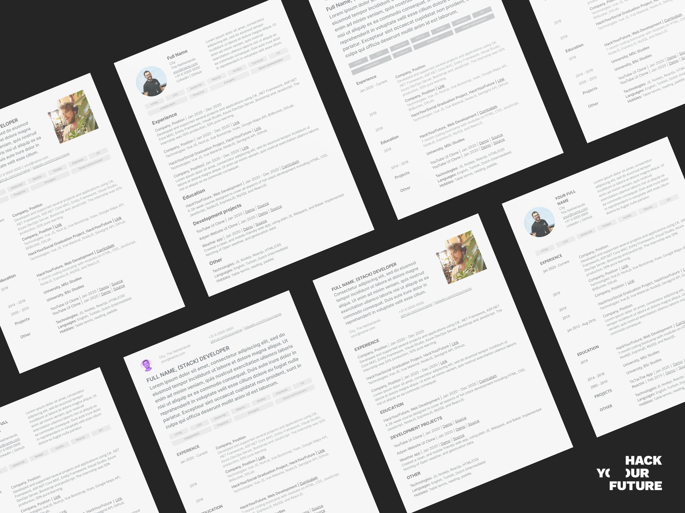

# Your Personal Brand

Technical and soft skills are incredibly important to get and keep a job or internship, but before you get one, you will have to get the attention of a company or recruiter, so that they give you an opportunity to interview with them.

At HackYourFuture we help our graduates connect with partner companies and other businesses for internship opportunities. Still, for you to be invited for an interview, the company needs to be interested in your profile. For that, it is important that you have a slick personal brand.

**Your personal brand is usually comprised of:**
- [Your Curriculum](yourcurriculum.md)
- Your GitHub Profile(yourgithub.md)
- Your LinkedIn Profile (Coming soon!)
- Your Online Portfolio (Coming soon!)

In this guide we will explain each of them, what you need to keep in mind when building your own, and share with you some online resources to make the job easier.

## Additional reading material

Crafting a good personal brand takes time, effort and self reflection. The more you know about you and about the task at hand, the higher the chances you will end up interviewing with companies quickly. Here are some of the best articles we’ve found in the WWW to get you on subject!

- [10 Soft Skills Every Developer Needs](https://hackernoon.com/10-soft-skills-every-developer-needs-66f0cdcfd3f7)
- [How to Write a Short Professional Bio](https://business.tutsplus.com/tutorials/how-to-write-a-short-bio--cms-30643)
- [Web Developer Resume Examples](https://standardresume.co/examples/web-developer)
- [Google Slides Templates for HYF students](https://docs.google.com/presentation/d/1VGbSrhNKhX3QM7lpbE5Lo_-nbUUXU9Vgpvzy0P_hhEM/copy)
- [Basic writing and formatting syntax for GitHub](https://docs.github.com/en/free-pro-team@latest/github/writing-on-github/basic-writing-and-formatting-syntax)

