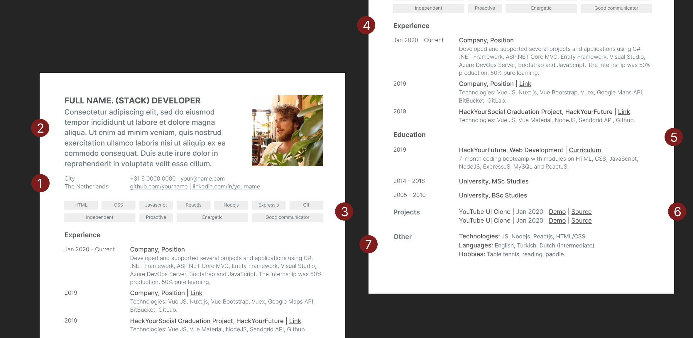

# Your Curriculum (or resume)

Securing an interview requires a polished resume that highlights your work experience, qualifications, and technical skills. Your resume needs to effectively communicate that you have the skills and experience required for the position. As a web developer, you aren’t expected to be a graphic design expert, but a well designed resume can make a big difference. Most recruiters only spend a few seconds on their initial resume scan.

Writing the perfect resume is less about showing how great you are and more about showing the hiring person why you’re the ideal person to help them reach their goals. The key to doing this is being relevant and to the point. In this guide you will find a few important resume writing tips and resources to help you get started:

1. The Do’s & Don’ts of Resume Writing
2. The Structure of a HYF Graduate’s CV
3. Additional reading material
4. The HackYourFuture CV template pack
5. Submitting your CV to the HYF team
6. Bonus: The Cover Letter (Coming soon!)

## 1. The Do’s & Don’ts of Resume Writing

You’ve likely heard conflicting statements of what you should and should not include in a resume. We’re clearing through the clutter with a list of do’s and don’ts to help you write a resume that will get you an interview, if not hired. 

Keep in mind that the HYF team is always available to help you improve your CV. However, in order for us to do that, we expect you to read this guide and follow each and every step. Only then we can provide you with further support.

### DO: ###

**- Pay attention to details:** This should go without saying, but a great resume is free of any typos and grammatical errors and looks slick. For typose, getting a friend to check can be helpful in spotting any errors you might have missed. We also love [grammarly for Chrome](https://www.grammarly.com) which is a tiny app that works as a digital writing assistant to support you create clear and effective communication! For design in general, be sure to have good contrast and clarity and make it pixel perfect as if it were a website. Your CV also tells the hiring manager or recruiter how much attention for detail you have and how you structure your content. Both crucial skills for a web developer!

**- Keep it concise:** A recruiter’s time is limited, so keep it focused and to the point. The ideal resume length should be one page for a printed resume, two pages if you have extensive relevant experience which is probably not the case when you come out fresh from our program so we strongly recommend you to stick to one page. Also, a resume is not a portfolio, and adding too many stylized details or too much information can make your resume design more distracting, taking away from the content itself. Try to stick with your biggest accomplishments, your most beautiful and challenging projects and avoid using over-the-top fonts, colors, and complicated layouts. Remember, sometimes less is more :)

**- Keep it up to date:** Your resume should include your most impressive projects and accomplishments. For that reason, we suggest updating your CV every time to create a new amazing project or take part in an internship. Keep in mind that the better the projects, the more chances you will have to be invited to take part in an interview.

**- Use a balance of soft and hard skills:** It is important to include a mix of both hard and soft skills on your resume, as when combined, they make you a highly desirable candidate. In many instances, soft skills can help enrich your hard skills—for example, your hard Javascript skills will be supported by an ability to collaborate as a team, problem solve and meet deadlines. 

**- Mention accomplishments and make it measurable:** In addition to your strengths and responsibilities in your resume, try backing them up with real work achievements. Focus on how that activity resulted in a positive difference for that employer, team or user. You should also try to quantify your accomplishments with numbers, providing context whenever possible

**- Write it in reverse chronological order:** Start with your most recent and relevant experiences and work your way through your previous job titles.

### DON’T ###

**- Exaggerate (or lie):** It could be tempting to ‘bend the truth’ a bit on your resume. Maybe you watched a video or did a short Python or Java course, so it might feel like a good idea to add it to your skillset. Do not do it. Do not (ever) use exaggerated information on your CV. Every fact you include on your resume should be supported by your past references, colleagues and most importantly, knowledge. Chances are you will be interviewed by someone with many more years of web development experience than you and interviewers usually zoom in on everything you put on your CV. Better to be interviewed with a simple CV and nailing your technical assignment, than having the interviewers create a lot of (unreal) expectations about your skills.

**- Add unnecessary details:** Employers are not interested in seeing 20 Udemy certifications, whether or not you have a driver's license, where you were born, if you are married or not or where exactly do you live (city is enough).

**- Use templates that are not flexible:** If you send the HYF team a PDF it is VERY hard and time consuming for us to provide you with feedback. Instead, please use google docs or (even better) stick to some of the great looking templates we share with you on this guide!

## 2. The Structure of a HYF Graduate’s CV:

While there are no exact ways of doing a resume, there are some best practices we’ve seen have worked well for our graduates. Your resume needs to be professional looking and well-organized. It should also link to you other components of your personal brand such as your GitHub and LinkedIn. 

There are seven main sections you need to incorporate in your resume. Each one is critical and serves its own purpose when you're applying for an internship:

1. Your photo and contact information
2. Your bio
3. Your skills (soft and hard)
4. Your experience (including your graduation and Fellowship projects)
5. Your education (including HackYourFuture)
6. Your (additional) projects
7. Other information including languages and hobbies

Each of these sections should be clearly separated with easy to read headers. Let’s walk through some of these sections so you can better understand what to include:

