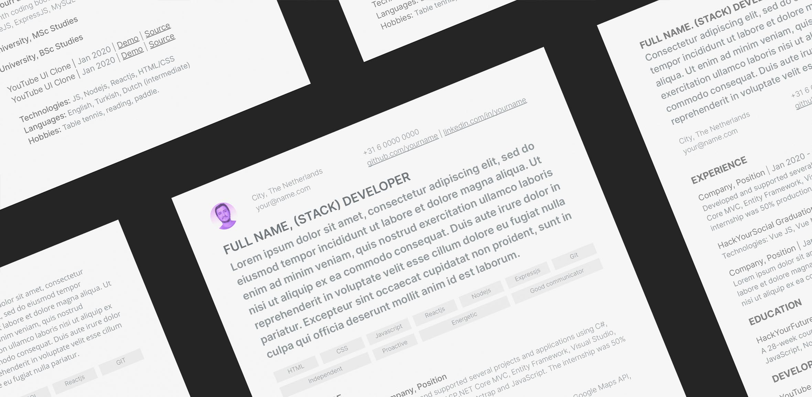

# Your Curriculum (or resume)

Securing an interview requires a polished resume that highlights your work experience, qualifications, and technical skills. Your resume needs to effectively communicate that you have the skills and experience required for the position. As a web developer, you aren’t expected to be a graphic design expert, but a well designed resume can make a big difference. Most recruiters only spend a few seconds on their initial resume scan.

Writing the perfect resume is less about showing how great you are and more about showing the hiring person why you’re the ideal person to help them reach their goals. The key to doing this is being relevant and to the point. In this guide you will find a few important resume writing tips and resources to help you get started:

[1. The Do’s & Don’ts of Resume Writing](https://github.com/HackYourFuture/yourpersonalbrand/blob/main/yourcurriculum.md#1-the-dos--donts-of-resume-writing)
[2. The Structure of a HYF Graduate’s CV](https://github.com/HackYourFuture/yourpersonalbrand/blob/main/yourcurriculum.md#2-the-structure-of-a-hyf-graduates-cv)
[3. The HackYourFuture CV template pack](https://github.com/HackYourFuture/yourpersonalbrand/blob/main/yourcurriculum.md#3-the-hackyourfuture-cv-template-pack)
[4. Submitting your CV to the HYF team](https://github.com/HackYourFuture/yourpersonalbrand/blob/main/yourcurriculum.md#4-submitting-your-cv-to-the-hyf-team)
[5. Bonus: The Cover Letter (Coming soon!)](https://github.com/HackYourFuture/yourpersonalbrand/blob/main/yourcurriculum.md#5-bonus-the-cover-letter-coming-soon)

## 1. The Do’s & Don’ts of Resume Writing

You’ve likely heard conflicting statements of what you should and should not include in a resume. We’re clearing through the clutter with a list of do’s and don’ts to help you write a resume that will get you an interview, if not hired. 

Keep in mind that the HYF team is always available to help you improve your CV. However, in order for us to do that, we expect you to read this guide and follow each and every step. Only then we can provide you with further support.

### DO: ###

**- Pay attention to details:** This should go without saying, but a great resume is free of any typos and grammatical errors and looks slick. For typose, getting a friend to check can be helpful in spotting any errors you might have missed. We also love [grammarly for Chrome](https://www.grammarly.com) which is a tiny app that works as a digital writing assistant to support you create clear and effective communication! For design in general, be sure to have good contrast and clarity and make it pixel perfect as if it were a website. Your CV also tells the hiring manager or recruiter how much attention for detail you have and how you structure your content. Both crucial skills for a web developer!

**- Keep it concise:** A recruiter’s time is limited, so keep it focused and to the point. The ideal resume length should be one page for a printed resume, two pages if you have extensive relevant experience which is probably not the case when you come out fresh from our program so we strongly recommend you to stick to one page. Also, a resume is not a portfolio, and adding too many stylized details or too much information can make your resume design more distracting, taking away from the content itself. Try to stick with your biggest accomplishments, your most beautiful and challenging projects and avoid using over-the-top fonts, colors, and complicated layouts. Remember, sometimes less is more :)

**- Keep it up to date:** Your resume should include your most impressive projects and accomplishments. For that reason, we suggest updating your CV every time to create a new amazing project or take part in an internship. Keep in mind that the better the projects, the more chances you will have to be invited to take part in an interview.

**- Use a balance of soft and hard skills:** It is important to include a mix of both hard and soft skills on your resume, as when combined, they make you a highly desirable candidate. In many instances, soft skills can help enrich your hard skills—for example, your hard Javascript skills will be supported by an ability to collaborate as a team, problem solve and meet deadlines. 

**- Mention accomplishments and make it measurable:** In addition to your strengths and responsibilities in your resume, try backing them up with real work achievements. Focus on how that activity resulted in a positive difference for that employer, team or user. You should also try to quantify your accomplishments with numbers, providing context whenever possible

**- Write it in reverse chronological order:** Start with your most recent and relevant experiences and work your way through your previous job titles.

### DON’T ###

**- Exaggerate (or lie):** It could be tempting to ‘bend the truth’ a bit on your resume. Maybe you watched a video or did a short Python or Java course, so it might feel like a good idea to add it to your skillset. Do not do it. Do not (ever) use exaggerated information on your CV. Every fact you include on your resume should be supported by your past references, colleagues and most importantly, knowledge. Chances are you will be interviewed by someone with many more years of web development experience than you and interviewers usually zoom in on everything you put on your CV. Better to be interviewed with a simple CV and nailing your technical assignment, than having the interviewers create a lot of (unreal) expectations about your skills.

**- Add unnecessary details:** Employers are not interested in seeing 20 Udemy certifications, whether or not you have a driver's license, where you were born, if you are married or not or where exactly do you live (city is enough).

**- Use templates that are not flexible:** If you send the HYF team a PDF it is VERY hard and time consuming for us to provide you with feedback. Instead, please use google docs or (even better) stick to some of the great looking templates we share with you on this guide!

## 2. The Structure of a HYF Graduate’s CV:

While there are no exact ways of doing a resume, there are some best practices we’ve seen have worked well for our graduates. Your resume needs to be professional looking and well-organized. It should also link to you other components of your personal brand such as your GitHub and LinkedIn. 

There are seven main sections you need to incorporate in your resume. Each one is critical and serves its own purpose when you're applying for an internship:

1. Your photo and contact information
2. Your Bio
3. Your skills (soft and hard)
4. Your experience (including your graduation and Fellowship projects)
5. Your education (including HackYourFuture)
6. Your (additional) projects
7. Other information including languages and hobbies

Each of these sections should be clearly separated with easy to read headers. Let’s walk through some of these sections so you can better understand what to include.

### 1. Your Photo and contact information:

Every CV should include your full name, your position (being full-stack, frontend or backend), your city and country, your email, your phone number, your GitHub (with a link) and your LinkedIn (also linked). Here you can also add your portfolio if you have one.

While there are a lot of mixed thoughts about whether to include or not your (professional) picture, we strongly advise it. 

### 2. Your Bio: 

Your CV Bio needs to be unique and captivate the reader. This is your opportunity to grab the attention of the recruiter and draw them into reading the rest of your resume.

It should highlight what makes you stand out from the other people applying for the internship or job and call attention to who you are as a person and as a professional.

Here some examples:

**Example 1:** Developer with a BSc in Electrical and Electronics Engineering and a MSc in Information Systems. After 4 years working as a Technical Specialist I had to leave Turkey seeking refugee status. Today I allocate all my energy to building a new future for me and my family by doing what I like the most: coding and solving problems. I'm a responsible and caring person that learns fast, likes to share, and takes work and personal growth seriously.

**Example 2:** Energetic Full Stack Web Developer ‘in love’ with JavaScript. For me, web development is more than just writing code. Is to communicate and work well with others in a team, to be curious and open to criticism and different approaches, to solve problems and to never stop learning. I'm currently looking for an opportunity to continue doing what I love, in a challenging but friendly environment.

**Example 3:** Avid learner, debate lover, and forever optimist. I like creating products that either have fun and nifty features or solve a genuine problem for people. I love creating products that have both of those things. Above all that, I love collaborating and working on a team! My hobbies include having several craft projects on the go at once, daydreaming about space, and eating snacks.

 
### 3. Your skills 

This section enables recruiters to quickly scan your resume to see what programming languages, software frameworks, and databases you have experience with and to get an idea of how you are as a person. That’s why, we recommend adding a mix of both hard and soft skills. 

You should only list the technical skills that you’re highly proficient in. Don’t list skills that you’re only familiar with as this may backfire once the interview rolls around. You could potentially lose credibility if an interviewer starts asking questions about a programming language you haven’t mastered.

HTML, CSS, Javascript, MySQL, Nodejs, Git and Reactjs are the most common ones after HackYourFuture. In some cases you can also add ExpressJS, Elastic Search, AWS or other skills that you have learned during your graduation or fellowship projects.

When it comes to soft skills, be sure to include only those 2, 3 or 4  that you are particularly good at and that you can back up with great examples during your interview. Some of these soft skills could include: Empathy, communication, teamwork, problem solving, grit, patience, open mindedness, accountability, creativity and time management. Read more about these here.

### 4. Your experience (including your graduation and Fellowship projects)

Besides adding the company name, your position and date (assuming that the experience is relevant) is good to include a short description of your function and your specific accomplishments or contributions.

Be sure to also include your graduation and Fellowship projects in this section (with links to the deployed websites) as they are probably your most web development related experiences! Here some examples:

**HackYourSocial at HackYourFuture | Jan 2019 | Link**
Created a clean, and mobile-friendly web app using NodeJS, ReactJS, Redux and MongoDB to help travelers connect with each other and exchange tips. Implemented fetching of data through APIs and geolocation, authentication & authorization and client server model.

**TrackIt App, Fellowship | Mar 2020 | Link**
Responsive Full-stack app developed using the MERN stack that allows users to track their personal assets (such as stocks and cryptocurrencies), financial gains and losses by bringing information from different public APIs and other sources to one central dashboard.

### 5. Your education (including HackYourFuture)

The educational section of your resume is still an important aspect, however, you shouldn’t go into too much detail. The more experience you have, the less you need to focus on your education section.

You need to list your university, degree obtained, and dates you attended in your education section. 

As for your HackYourFuture Education, simply add a short description and links to the curriculum. Here some examples:

**HackYourFuture, Web Development | Jan 2020 - Aug 2020 | Curriculum**
7-month coding bootcamp with modules on HTML, CSS, JavaScript, NodeJS, MySQL and ReactJS.

**Web Development at HackYourFuture | Jan 2020 - Aug 2020**
A 28-week course designed to cover all aspects of full-stack development including HTML, CSS, JavaScript, NodeJS, ExpressJS, MySQL and ReactJS. Check the curriculum here.

### 6. Your (additional) projects

Companies hiring interns from the HackYourFuture program know that you don’t have years of experience working as a web developer. However, they want to know you work hard, that you are eager to grow, that you have an eye for detail (especially if you want to be a frontend or full stack developer) and that you never stop learning. A way to show just that is by adding the most challenging and beautiful projects you’ve worked on during and after the program. Be sure to provide a link to the deployed version of the project and another link to the source code.

Here some beautiful examples:

**Weather app | Jan 2020 | Demo | Source**
Clean, and mobile-friendly web app built using plain JS, Webpack, and Babel. Implemented fetching of Open-weather, and geolocation data. 

**Todo app | Jan 2020 | Demo | Source**
Simple (but great looking) to do app built with Reactjs, Nodejs and Expressjs allowing users to register and save their data, tag their activities and more.

**YouTube UI Clone | Jan 2020 | Demo | Source**

### 7. Other information including languages and hobbies

Give interviewers more information to get to know you better and have something else to talk about during the interview.

When it comes to languages, we suggest you add your native language and english of course, and if you know any other language such as dutch, highlight your level: Intermediate, basic, etc. Just like this:

**Languages: English, Spanish, Dutch (intermediate)**

In this case, we do not add native or proficiency to English or Spanish given that in this case Spanish is the applicant’s native language and English is simply expected to be at a working proficiency.

## 3. The HackYourFuture CV template pack

To make your job easier, we’ve created a set of templates with sections tailored to the needs of a HackYourFuture student.

These templates can be mixed and matched together and you can also play around with style (typography and colors) to achieve a style and format that goes in line with your content and preferences.

To access the templates click here and don’t forget to check the following video that explains how to repurpose the templates for your own use:

**ADD VIDEO**

## 4. Submitting your CV to the HYF team

Once your CV is ready, please submit the link to the HYF team here. 

We will give you feedback (if needed) to be sure you end with a good CV that gets you interviews. However, keep in mind that besides a nice looking CV, you need to continuously work on new projects that reflect your capabilities. This is by far your fastest way to a job!

Once you submitted your CV, please be sure to continue to update it in the same file. That way we can assure that every time we share it with a prospective employer, we share your most up to date version.  

**Remember:** If for any reason you decide not to use our template pack, be sure to use templates that are not flexible and that allows for collaboration: If you send the HYF team a PDF it is VERY hard and time consuming for us to provide you with feedback, so we won't do so. Instead, please use google docs or (even better) stick to some of the templates we share with you on this guide! If you have ideas on how to make them better, send a PRs with your thoughts and we might incorporate them on the next release!

## 5. Bonus: The Cover Letter (Coming soon!)

**8Done with your CV? Time to polish on your LinkedIn Profile!***

