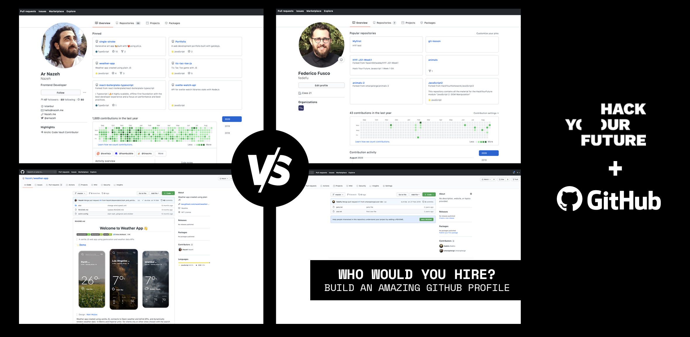

# Your GitHub Profile

Your GitHub profile tells people (including recruiters) the story of your work through the repositories you're interested in, the contributions you've made, and the conversations you've had. While designers and artists use a creative portfolio to showcase past work and sell themselves, GitHub profiles are portfolios for programmers. 

In the image above, the person on the left has clearly a LOT more experience than the one on the right: He organises his code better, his repos are well documented and include visuals...In short, your GitHub profile says a lot about you. Besides showing your actual code, your profile gives insights into:

- How you work and collaborate
- How much effort you put into coding (and how often you commit)
- How you interact with other devs (i.e with your teachers in your HYF assignments)

To be sure your GitHub profile is attractive to recruiters, in this guide we will share with you: 

1. Five tips on how to set up your GitHub profile to showcase your best work to potential recruiters
2. The most important GitHub best practices for you to always keep top of mind.
3. Inspiring GitHub profiles to get some ideas to pump your own!

## 1. Five tips on how to set up your GitHub profile 

### 1. Start by building a great looking homepage

Your GitHub’s profile homepage is one of the first things recruiters will look at when they are reviewing your CV. Because of this, your profile needs to look clean and be a good representation of who you are as a developer. Be sure to have a professional picture, followed by a short bio, and links to any other relevant websites that showcase what you do: your portfolio (if you have one and it looks great), your StackOverflow and CodePen links, etc.

Not less important, build a Stunning README page and be sure recruiters can easily navigate throughout your GitHub and find your best work. We strongly recommend you look at the following articles and take some inspiration:

- [Build a stunning README For Your GitHub Profile](https://towardsdatascience.com/build-a-stunning-readme-for-your-github-profile-9b80434fe5d7)

- [Make Your GitHub Profile Great Again!](https://dev.to/pedes/make-your-github-profile-great-again-oan)

- [Awesome Profile README Templates](https://github.com/kautukkundan/Awesome-Profile-README-templates)

### 2. Remove zero contributed forks
One thing many developers do is forking public repositories and then sending pull requests to the original repo (like you do with your HYF homework or Repo). What tends to happen with this approach is that developers have profiles containing hundreds of forked repositories with zero contributions. This can make you look inconsistent and all over the place. If you are applying to jobs it is better to clean up your profile and only leave the repo’s to which you’ve made contributions that ended up in the root repositories.

### 3. Handpick your pinned repositories to showcase your best work
The pinned repositories that appear at the top of your profile should showcase repositories that you want to highlight to the recruiter, which should be relevant and show work that has been done. Pick and pin your top three-six repositories that you want recruiters to see first. [Here](https://docs.github.com/en/free-pro-team@latest/github/setting-up-and-managing-your-github-profile/pinning-items-to-your-profile) you can find the instructions on how to do that. 

Needless to say, be sure your pinned repos are referential of your top skills and be sure they are properly groomed...More on that next!

### 4. Groom your showcased repositories

Once you’ve selected a few repositories to showcase, make sure they’re publicly accessible and not locked under a password. All projects should have a README including:

**- A description:** One that makes it easy to understand for someone who has only a minute.  
**- The outcome:** Illustrate what that code is supposed to produce. Show screenshots of your app!  
**- The Stack:** List all the core relevant frameworks and libraries that make the project work. This gives technical recruiters, who may not be familiar with every single framework, a glimpse of what’s important right off the bat. 
**- The vision:** Clearly illustrate where this project is heading. 
**- The version:** Indicate where you are with the project. For example, is it complete or work in progress? If work in progress, state clearly what is done and what is pending or what’s not working. I like to put a disclaimer in case people want to use work done in a production environment. It’s perfectly fine to have stuff that does not work if it’s been highlighted. 
**- Your contributions:** If you are showcasing a large project (like your graduation project) there is probably a lot of work done by other people. If you are forking the repo so that you can have it on your profile make it clear what you’ve worked on specifically. This way there won’t be surprises or false expectations during your interview! 
**- Running instructions:** You should have a clear explanation of how a user can run the application. Activities such as npm run, docker run or whatever is used by your framework. 
**- The online demo:** Try, by all means, to ensure running a demo version of your project. Like some may say: “A demo is worth a thousand words”. Be sure to also include a username and password so that the visitor/recruiter doesn’t need to register to test your work. For this you can also use [GitHub pages](https://pages.github.com/). 
**- Explain the filing system:** Be sure to use clear names that explicitly state the contents of each folder to improve comprehension and productivity. 

#### Some Great Examples:
- [The Weather App :cloud:](https://github.com/Nazeh/weather-app)
- [To-do App by Salih :heavy_check_mark:](https://github.com/salih18/MERN-Todo-App)

****Pro tip:**** While you can't upload videos to a Github Readme to show how your app looks, you can upload Gif images, so you can make a short video of how your app looks, convert it into a gif, and add it to your project's readme. Here a cool example:

### 5. Be sure your code is clean, commented, and well-organized 

It’s always good practice to review the code in your starred or pinned repos and be sure people other than you (with and without technical knowledge) can get a good idea of your potential and capabilities.

## 2. Github Best Practices

1. Write clean code. Have a good project structure. If possible, write tests. Don’t use too many hacks in your projects. If a recruiter skims through the code, they shouldn’t find any red flags.

2. Commit often and make clean commit messages. It’s easy to have commit messages like “pleaseeee work”, “@#$%”, etc. Don’t do that. Maintain professionalism for your personal projects as well. Remember that your work is visible to other devs or recruiters.

3. There are many Github integrations available (like Travis CI, etc). Using them for your personal projects shows that you are serious about the quality of code in your project and you care about it.

4. Don’t fork repositories if you are not going to work on them. Cluttered profiles don’t make anyone happy. If you like a project, please star it, don’t fork it.

5. Contribute to open source projects: This shows that you can work well with a community, you know how to dive into large codebases and can adapt to different coding standards. Having pull requests/issues/reviews visible on your profile makes it a bit more attractive.

## 3. Inspiring GitHub profiles

Here is a selection of the GitHub profiles we highly recommend as they have extremely well-documented projects and are generally nice examples for good GitHub practices:

- [Ar Nazeh](https://github.com/Nazeh)
- [TJ Holowaychuk](https://github.com/tj)
- [Paul Irish](https://github.com/paulirish)
- [Evan You](https://github.com/yyx990803)
- [Jake Wharton](https://github.com/JakeWharton)

***Done with your GitHub Profile?*** Time to [work on your LinkedIn one!](yourlinkedin.md)
