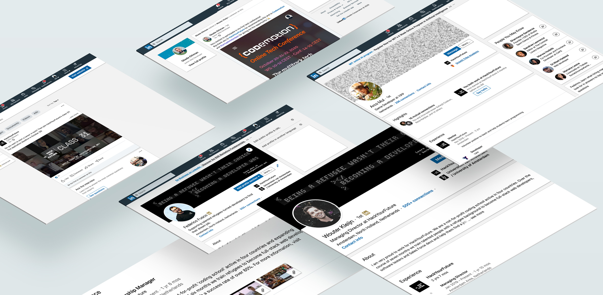

# Your LinkedIn Profile

With more than 600 million users worldwide, LinkedIn is the largest professional network on the planet. If you're serious about your career and professional advancement, you need a LinkedIn profile that's optimized and up to date. Your LinkedIn profile is your chance to get your name (and face) in front of thousands of professionals in your industry. 

However, it's not enough to just have a LinkedIn page. You need a great LinkedIn profile that draws attention, says the right things, and helps you really connect with the people who can help you expand your career. 

Having a profile on LinkedIn helps:

- Create opportunities and validate your achievements: Since people and organizations use LinkedIn, a LinkedIn profile will help you get noticed. An updated profile is a great way to ensure that you can be found by the right people at the right time (including recruiters) and that all the info they need is accessible. Moreover, when you apply to jobs, is very likely that the company or recruiter will look for you on LinkedIn, so better have a great looking profile!
- Build your network and track your professional milestones: All of your professional achievements (new job, work anniversary, promotion, etc.) can be recorded and displayed on your LinkedIn profile. It’ll help you showcase your professional experience and achievements to other members who view your profile. An updated profile opens the door to meeting new members and making connections (which could lead to future jobs as well).

In this guide, we will give you 10 simple tips to help make your LinkedIn profile stand out!

***Before we get started, be sure to [finish your CV](https://github.com/HackYourFuture/yourpersonalbrand/blob/main/yourcurriculum.md) as you will use much of that information here.***

### 1. Put in the time
Simply put, the more complete your profile, the better the odds that recruiters will find you in the first place or that recruiters that saw your CV will be impressed by your online brand. It’s also important that he or she can find what your skills are, where you’ve worked, and what people think of you. So, don’t get lazy—fill out every single section of your profile.

### 2. Get a custom URL
It’s much easier to publicize your profile with a customized URL (ideally linkedin.com/yourname), rather than the long combination of numbers that LinkedIn automatically assigns when you sign up. How to get one? On the Edit Profile screen, at the bottom of the gray window that shows your basic information, you’ll see a Public Profile URL. Click “Edit” next to the URL, and specify what you’d like your address to be. When you’re finished, click Set Custom URL.

### 3. Add a professional profile photo
A good profile photo increases the credibility of your profile and helps you stand out from the crowd. Members with a profile photo on LinkedIn can get up to 21 times more profile views that members without a photo. Be sure to Choose a clear, friendly, and appropriately professional image. 

### 4. Brand your profile with a background photo

Give your profile page a bit more personality, or branding, with a visually appealing [background image](https://www.linkedin.com/help/linkedin/answer/49960) to personalize your profile. Check out some more [tips for picking the right LinkedIn profile photo](https://business.linkedin.com/talent-solutions/blog/2014/12/5-tips-for-picking-the-right-linkedin-profile-picture).

If you are in doubts which images you can use for your background images, check [Unsplash](https://unsplash.com/s/photos/javascript) and [500px](https://500px.com/search?q=programmer&type=photos) for some stunning pics!

### 5. Make your headline stand out
Your headline is created when you add your positions to your profile. However, you can re-write it to either promote an area of expertise or to let your personality shine through. Here some simple ideas:

- Full-stack web developer with a passion for React
- Architect-turned-developer that loves solving problems and working in teams
- 

### 6. Add you Bio (or summary) 
The About section of your profile expresses your mission, motivation, and skills to people who view your profile. Ideally, you should limit the text to one or two paragraphs while filling this section. For more tips on this check [your Bio section](https://github.com/HackYourFuture/yourpersonalbrand/blob/main/yourcurriculum.md#2-your-bio) on the CV repo.

### 7. Add all your relevant [work](https://www.linkedin.com/help/linkedin/answer/1646) and [education](https://www.linkedin.com/help/linkedin/answer/381) experiences
You should keep the profile updated with all your professional experiences that align with your current career goals. You can also add media samples to provide quick access to your work portfolio. **Be sure that every experience listed on your cv is also part of your LinkedIn profile!***

### 8. Request recommendations from your connections
[A recommendation](https://www.linkedin.com/help/linkedin/answer/96) is written to recognize or commend a connection, such as a colleague, business partner, or student. There’s no limit to the number of recommendations you can request for. Once you accept a recommendation written by a connection, it becomes visible to your network by default. If you’ve done a stellar job at a specific module or project, be sure to ask your HackYourFuture mentor to write a recommendation for you!

### 9. Add your skills and get endorsements
Including specific skills on your LinkedIn profile is a great way to showcase your abilities to other members, such as your peers, colleagues, managers, and even recruiters. You can [add skills](https://www.linkedin.com/help/linkedin/answer/4976) such as Reactjs, Nodejs, Javascript...but also your soft skills. They're a simple and effective way of building your professional brand and engaging your network.

Once you've added a skill to your profile, your skills can be validated by 1st-degree connections to reinforce their weighting. These are called [skill endorsements](https://www.linkedin.com/help/linkedin/answer/33125), which are different than recommendations. When a connection endorses your skills, it contributes to the strength of your profile, and increases the likelihood that you'll be discovered for opportunities related to the skills you possess.

### 10. Connect with people!
Be sure to connect with your mentors, colleagues and staff at HackYourFuture. You can also add people that you meet at conferences for instance. What’s important here is that every time you add someone, you also add a note on why you are making that connection!

If you want to dig even deeper into how to create a great LinkedIn profile, watch [this course](https://www.linkedin.com/learning/learning-linkedin-3) on LinkedIn Learning!

***Now that you are finished with your CV, is a good time to start preparing for interviews! Check the [Interview Preparation Repo for HYF Graduates!](https://github.com/HackYourFuture/interviewpreparation)

